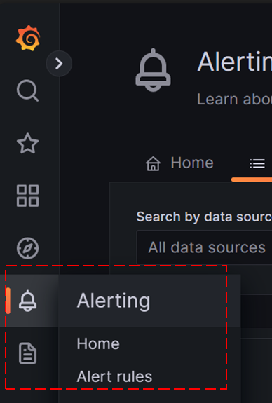
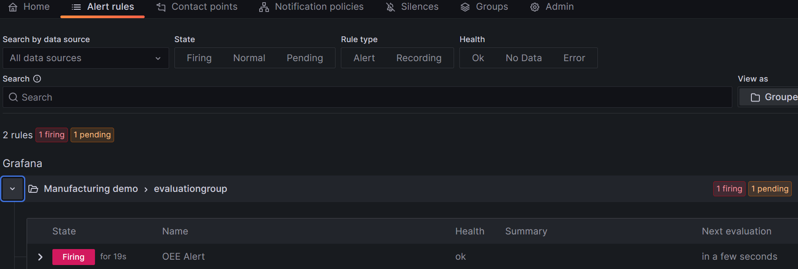

# Grafana Alerts Setup

In this example, we will create a low OEE alert for one of the production lines. First, login to your Grafana service and select Alert rules in the menu.



Then click on 'Create Rule' on the right.


Then give your alert a name and select 'Azure Data Explorer' as data source. Click on query on the left


In the query field, enter the following. In this example, we will use the 'Seattle' production line. 

```
let oee = CalculateOEEForStation("assembly", "seattle", 6, 6);
print round(oee * 100, 2)
```
and select 'table' as output. 

Scroll down to the next section. Here, you will configure the alert threshold. In this example, we will use 'below 10' as the threshold, but in production environments, this will be higher.


Select the folder where you want to save your alerts and configure the 'Alert Evaluation behavior' - here, select 'every 2 minutes'.

Hit the 'Save and exit' button on the top. 

In the overview of your alerts, you can now see an alert being triggered when your OEE is below '10'.



You can integrate this with, for example, Microsoft Dynamics Field Services.
